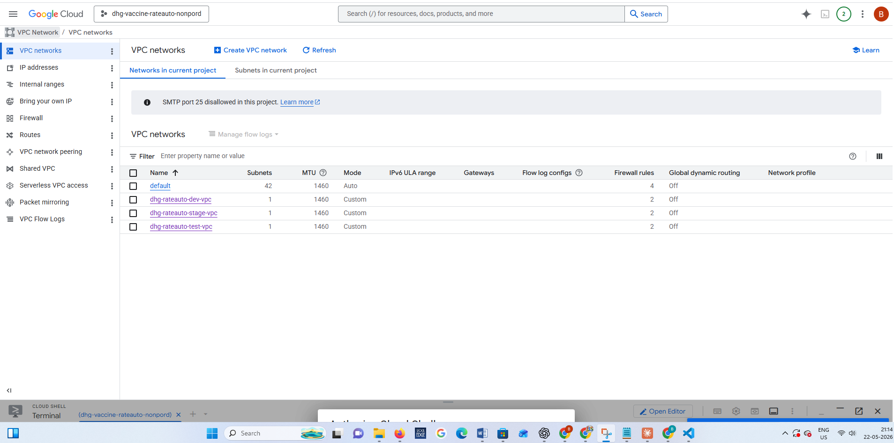
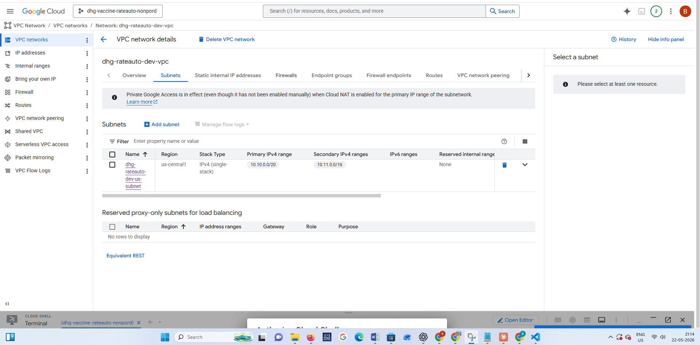
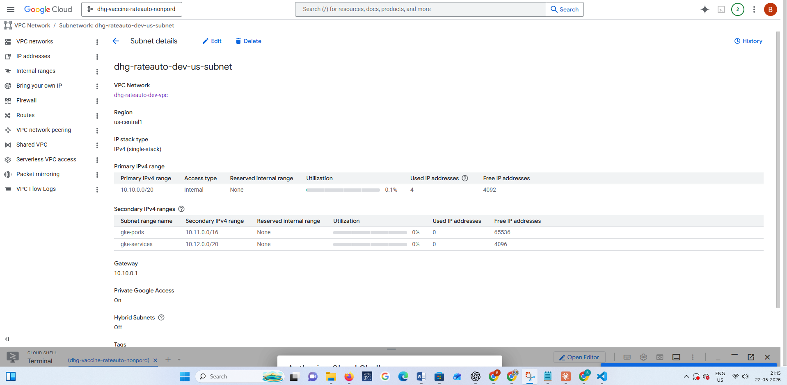

<div align="center">


# 🌐 dhg-rateauto-tf-vpc

### Terraform · Google Cloud VPC · Private Network Foundation
### DHG Rate Automation Platform - `dhg-vaccine-rateauto-nonpord`

[](https://www.terraform.io)
[](https://cloud.google.com/vpc)
[](https://registry.terraform.io/providers/hashicorp/google/latest)
[](https://cloud.google.com/nat)
[](https://developer.hashicorp.com/terraform/language)
[](https://cloud.google.com/iam/docs/workload-identity-federation)

---

*Provisions the foundational private network layer for the DHG Vaccine Fee platform - custom VPC, GKE-ready subnet with secondary ranges, Cloud Router, Cloud NAT, VPC Flow Logs, and a default-deny firewall baseline - all built for zero public exposure.*

</div>

---

## 📋 Table of Contents

- [Overview](#-overview)
- [UI Gallery](#-ui-gallery)
- [Why a Custom VPC](#-why-a-custom-vpc)
- [Architecture](#-architecture)
- [Network Design Decisions](#-network-design-decisions)
- [Repository Structure](#-repository-structure)
- [Prerequisites](#-prerequisites)
- [Resources Created](#-resources-created)
- [File-by-File Breakdown](#-file-by-file-breakdown)
- [Variables Reference](#-variables-reference)
- [Outputs Reference](#-outputs-reference)
- [Firewall Rules Explained](#-firewall-rules-explained)
- [Cloud NAT Deep Dive](#-cloud-nat-deep-dive)
- [VPC Flow Logs](#-vpc-flow-logs)
- [CIDR Planning](#-cidr-planning)
- [Environments](#-environments)
- [Usage](#-usage)
- [How It Connects to GKE](#-how-it-connects-to-gke)
- [CI/CD Pipeline](#-cicd-pipeline)
- [Security Design](#-security-design)
- [Provider Versions](#-provider-versions)
- [Related Repositories](#-related-repositories)

---

## 🌐 Overview

This repository provisions the **foundational network layer** for the DHG Rate Automation platform on Google Cloud Platform. It is the **very first infrastructure component** deployed - every other resource (GKE cluster, Cloud SQL, GCS buckets, load balancers) depends on this VPC existing first.

The network follows a strict **private-by-default** philosophy:
- 🔒 GKE worker nodes get **no public IP addresses**
- 🗄️ Cloud SQL is accessible only via **private PSC IP** inside the VPC
- 🌍 Outbound internet access for nodes is tunnelled through **Cloud NAT only**
- 🚫 All inbound traffic is **blocked by default** - explicit allow rules only
- 📋 VPC **Flow Logs** record traffic for security audit and debugging

### 🔑 Key Facts

| Property | Value |
|---|---|
| 🏗️ **GCP Project** | `dhg-vaccine-rateauto-nonpord` |
| 🌍 **Region** | `us-central1` |
| 🌐 **VPC Name** | `dhg-rateauto-dev-vpc` |
| 🔌 **Subnet** | `dhg-rateauto-dev-subnet` |
| 📍 **Node CIDR** | `10.10.0.0/20` |
| 🐳 **Pod CIDR** | `10.10.16.0/20` |
| ⚙️ **Service CIDR** | `10.10.32.0/24` |
| 🛡️ **Default Inbound** | DENY ALL |
| 🔄 **Outbound** | Cloud NAT (auto IP) |
| 📊 **Flow Logs** | Enabled - 50% sampling, 10 min |

---

## 🖼️ UI Gallery

> 📌 **Note:** All images are stored in `docs/gallery/`. Upload your screenshots there to display them here.

### 🌐 VPC Network - GCP Console View


---

### 🔌 VPC Subnet


---

### 🗂️ Subnet Ranges for GKE Pods & Services


---


## 💡 Why a Custom VPC

Google Cloud creates a **default VPC** automatically in every project. However, the default VPC has significant limitations for production:

| Issue | Default VPC | Custom VPC ✅ |
|---|---|---|
| **Subnets** | Auto-created in every region | Single purpose-built subnet |
| **GKE secondary ranges** | Not pre-configured | Built-in `gke-pods` and `gke-services` ranges |
| **Flow Logs** | Disabled by default | Enabled at 50% sampling |
| **Firewall rules** | Overly permissive defaults | Default-deny baseline |
| **Routing mode** | Global | Regional (better isolation) |
| **Auditability** | Hard to track manual changes | 100% Terraform - every change in Git |
| **IaC managed** | No | Yes - repeatable across environments |

A custom VPC gives complete control, better security posture, and clear ownership of every network resource.

---

## 🏛️ Architecture

```
                        ┌──────────────────────────────────────────┐
                        │   GitHub Actions (CI/CD)                  │
                        │   WIF → Short-lived GCP token            │
                        └──────────────────┬───────────────────────┘
                                           │ terraform apply
                                           ▼
┌──────────────────────────────────────────────────────────────────────────┐
│            GCP Project: dhg-vaccine-rateauto-nonpord                      │
│                                                                            │
│  ┌─────────────────────────────────────────────────────────────────────┐  │
│  │           VPC: dhg-rateauto-dev-vpc                                  │  │
│  │           Routing Mode: REGIONAL  │  Auto Subnets: false            │  │
│  │                                                                       │  │
│  │  ┌──────────────────────────────────────────────────────────────┐   │  │
│  │  │          Subnet: dhg-rateauto-dev-subnet (us-central1)        │   │  │
│  │  │                                                                │   │  │
│  │  │  Primary CIDR:   10.10.0.0/20   ──▶  GKE Node IPs            │   │  │
│  │  │  Secondary[0]:   10.10.16.0/20  ──▶  GKE Pod IPs  (gke-pods) │   │  │
│  │  │  Secondary[1]:   10.10.32.0/24  ──▶  GKE Svc IPs  (gke-svc)  │   │  │
│  │  │                                                                │   │  │
│  │  │  ✅ private_ip_google_access = true                           │   │  │
│  │  │  ✅ VPC Flow Logs: INTERVAL_10_MIN | 50% | ALL_METADATA       │   │  │
│  │  │                                                                │   │  │
│  │  │  ┌───────────────────────────────────────────────────────┐   │   │  │
│  │  │  │           GKE Autopilot Cluster                        │   │   │  │
│  │  │  │           enable_private_nodes = true                  │   │   │  │
│  │  │  │           (no public IPs on worker nodes)             │   │   │  │
│  │  │  │                                                         │   │   │  │
│  │  │  │  ┌─────────────┐   ┌─────────────┐   ┌─────────────┐ │   │   │  │
│  │  │  │  │Frontend Pod │   │ Backend Pod │   │ Cloud SQL   │ │   │   │  │
│  │  │  │  │React+nginx  │   │  FastAPI    │   │ 10.10.0.3  │ │   │   │  │
│  │  │  │  └─────────────┘   └─────────────┘   └─────────────┘ │   │   │  │
│  │  │  └───────────────────────────────────────────────────────┘   │   │  │
│  │  └──────────────────────────────────────────────────────────────┘   │  │
│  │                                                                       │  │
│  │  ┌──────────────────────┐    ┌─────────────────────────────────┐    │  │
│  │  │    Cloud Router       │───▶│         Cloud NAT               │    │  │
│  │  │  dhg-rateauto-       │    │  dhg-rateauto-dev-vpc-nat       │    │  │
│  │  │  dev-vpc-router       │    │  AUTO_ONLY IPs                  │    │  │
│  │  └──────────────────────┘    │  ALL_SUBNETWORKS_ALL_IP_RANGES  │    │  │
│  │                               │  Logs: ERRORS_ONLY              │    │  │
│  │                               └────────────────┬────────────────┘    │  │
│  │                                                 │ Outbound only        │  │
│  │  ┌───────────────────────────────────────┐      ▼                    │  │
│  │  │  Firewall Rules                        │   Internet                │  │
│  │  │                                        │  (image pulls,            │  │
│  │  │  🚫 deny-all-ingress  P:65534         │   OS updates)             │  │
│  │  │     ALL protocols, src: 0.0.0.0/0     │                           │  │
│  │  │                                        │                           │  │
│  │  │  ✅ allow-internal    P:1000          │                           │  │
│  │  │     TCP+UDP+ICMP                       │                           │  │
│  │  │     src: VPC CIDRs only               │                           │  │
│  │  └───────────────────────────────────────┘                           │  │
│  └─────────────────────────────────────────────────────────────────────┘  │
└──────────────────────────────────────────────────────────────────────────┘
```

---

## 🔬 Network Design Decisions

### 1️⃣ Single Subnet with Three CIDR Ranges

The VPC uses **one subnet** with three IP ranges - a primary range for nodes and two secondary ranges for GKE workloads:

```
Subnet: dhg-rateauto-dev-subnet
├── Primary   10.10.0.0/20   → GKE worker node IPs       (4,094 addresses)
├── Secondary 10.10.16.0/20  → GKE pod IPs (gke-pods)    (4,094 addresses)
└── Secondary 10.10.32.0/24  → GKE service IPs (gke-svc) (  254 addresses)
```

GKE **requires** dedicated secondary ranges because pods and services need their own IP space to avoid exhausting node IPs and to enable GKE's IP aliasing (VPC-native networking).

### 2️⃣ REGIONAL Routing Mode

```hcl
routing_mode = "REGIONAL"
```

Regional routing means routes are only advertised within the same region (`us-central1`). This provides better **isolation between environments** - a dev VPC cannot accidentally route to a prod VPC through a misconfigured global route.

### 3️⃣ Private Google Access

```hcl
private_ip_google_access = true
```

This is critical for GKE nodes with no public IPs. Without it, private nodes cannot reach Google APIs (Container Registry, Artifact Registry, Cloud Storage, Secret Manager). With it enabled, API traffic goes through Google's internal network - no internet traversal, no public IP needed.

### 4️⃣ auto_create_subnetworks = false

```hcl
auto_create_subnetworks = false
```

Prevents Google from auto-creating subnets in all regions. We manage our own subnet explicitly - cleaner, more secure, and easier to audit.

### 5️⃣ delete_default_routes_on_create = false

```hcl
delete_default_routes_on_create = false
```

Keeps the default internet route (`0.0.0.0/0 → internet gateway`). This is needed for Cloud NAT to forward outbound traffic. Without it, Cloud NAT cannot forward packets even though it manages the IP translation.

---

## 📁 Repository Structure

```
dhg-rateauto-tf-vpc/
│
├── 📁 .github/
│   └── 📁 workflows/
│       └── 📄 terraform.yml      # CI/CD: plan on PR, apply on merge to main
│
├── 📁 environments/
│   ├── 📄 dev.tfvars             # Development network config + CIDRs
│   ├── 📄 test.tfvars            # Test network config + CIDRs
│   ├── 📄 stage.tfvars           # Stage network config + CIDRs
│   └── 📄 prod.tfvars            # Production network config + CIDRs
│
├── 📄 main.tf                    # VPC, Subnet, Router, NAT, Firewall (119 lines)
├── 📄 variables.tf               # 10 input variables (70 lines)
├── 📄 outputs.tf                 # 10 outputs consumed by GKE repo (49 lines)
├── 📄 providers.tf               # Google provider configuration
├── 📄 terraform.tf               # GCS backend configuration
├── 📄 versions.tf                # Terraform + provider version constraints
└── 📄 README.md                  # This file
```

---

## ✅ Prerequisites

| Requirement | Details |
|---|---|
| 🔧 **Terraform** | `>= 1.4` |
| ☁️ **Google Provider** | `~> 5.0` |
| 📁 **GCP Project** | `dhg-vaccine-rateauto-nonpord` |
| 🔌 **APIs enabled** | `compute.googleapis.com` |
| 🔐 **IAM permissions** | `roles/compute.networkAdmin`, `roles/compute.securityAdmin` |
| 🔑 **Authentication** | WIF (CI/CD) or `gcloud auth application-default login` (local) |

Enable the Compute API:

```bash
gcloud services enable compute.googleapis.com \
  --project=dhg-vaccine-rateauto-nonpord
```

---

## 📦 Resources Created

| # | Resource | Terraform Name | Description |
|---|---|---|---|
| 1 | `google_compute_network` | `vpc` | Custom VPC network (no auto-subnets) |
| 2 | `google_compute_subnetwork` | `subnet` | Single subnet with 2 secondary GKE ranges |
| 3 | `google_compute_router` | `router` | Cloud Router (prerequisite for NAT) |
| 4 | `google_compute_router_nat` | `nat` | Cloud NAT for private node internet access |
| 5 | `google_compute_firewall` | `deny_all_ingress` | Default-deny all inbound traffic (P:65534) |
| 6 | `google_compute_firewall` | `allow_internal` | Allow intra-VPC TCP/UDP/ICMP (P:1000) |

**Total: 6 resources** provisioned per environment.

---

## 🔍 File-by-File Breakdown

### 📄 `main.tf` - All 6 Resources (119 lines)

#### 🌐 Resource 1 - VPC Network

```hcl
resource "google_compute_network" "vpc" {
  name                            = local.vpc_name
  project                         = var.project_id
  auto_create_subnetworks         = false    # Manual subnet management only
  routing_mode                    = "REGIONAL"
  delete_default_routes_on_create = false    # Needed for Cloud NAT
  description                     = "VPC network for ${var.stage} environment"
}
```

**Why no auto subnets:** Auto-created subnets span all GCP regions with pre-defined CIDRs - wasteful and harder to audit. Our single explicit subnet gives full control.

---

#### 🔌 Resource 2 - Subnet with Secondary Ranges

```hcl
resource "google_compute_subnetwork" "subnet" {
  name                     = local.subnet_name
  project                  = var.project_id
  region                   = var.region
  network                  = google_compute_network.vpc.id
  ip_cidr_range            = var.subnet_primary_cidr
  private_ip_google_access = true    # Allows API access without public IP

  secondary_ip_range {
    range_name    = var.pods_range_name      # "gke-pods"
    ip_cidr_range = var.pods_cidr
  }

  secondary_ip_range {
    range_name    = var.services_range_name  # "gke-services"
    ip_cidr_range = var.services_cidr
  }

  log_config {
    aggregation_interval = "INTERVAL_10_MIN"
    flow_sampling        = 0.5               # 50% of flows logged
    metadata             = "INCLUDE_ALL_METADATA"
  }
}
```

**Secondary ranges** are not just nice-to-have - they are **required by GKE** for VPC-native pod networking. Without them, GKE cluster creation will fail.

**Flow Logs at 50%:** Logging every single packet would be prohibitively expensive. 50% sampling captures enough to detect patterns and debug issues while keeping Cloud Logging costs manageable.

---

#### 🔄 Resource 3 - Cloud Router

```hcl
resource "google_compute_router" "router" {
  name    = "${local.vpc_name}-router"
  project = var.project_id
  region  = var.region
  network = google_compute_network.vpc.id
}
```

Cloud Router is required as the parent resource for Cloud NAT. It uses BGP internally but in this configuration there is no custom BGP peering - it purely serves as the anchor for the NAT gateway. No additional configuration is needed.

---

#### 🌍 Resource 4 - Cloud NAT

```hcl
resource "google_compute_router_nat" "nat" {
  name                               = "${local.vpc_name}-nat"
  project                            = var.project_id
  router                             = google_compute_router.router.name
  region                             = var.region
  nat_ip_allocate_option             = "AUTO_ONLY"
  source_subnetwork_ip_ranges_to_nat = "ALL_SUBNETWORKS_ALL_IP_RANGES"

  log_config {
    enable = true
    filter = "ERRORS_ONLY"
  }
}
```

**`AUTO_ONLY`:** Google automatically allocates and rotates NAT external IPs - no manual IP reservation, no operational overhead.

**`ALL_SUBNETWORKS_ALL_IP_RANGES`:** Covers nodes (primary CIDR), pods (secondary), and services (secondary) - all private addresses can use NAT for outbound access.

**`ERRORS_ONLY`:** Logs only failed NAT translations. Logging all successful connections would flood Cloud Logging with millions of entries daily and generate significant costs.

---

#### 🚫 Resource 5 - Deny All Ingress Firewall

```hcl
resource "google_compute_firewall" "deny_all_ingress" {
  name      = "${local.vpc_name}-deny-all-ingress"
  project   = var.project_id
  network   = google_compute_network.vpc.id
  direction = "INGRESS"
  priority  = 65534

  deny {
    protocol = "all"
  }

  source_ranges = ["0.0.0.0/0"]
}
```

**Priority 65534** is one step above GCP's implied allow-all rule at 65535. Lower number = higher priority, so our explicit deny (65534) is evaluated before the GCP default (65535), establishing a **zero-trust baseline**.

---

#### ✅ Resource 6 - Allow Internal Firewall

```hcl
resource "google_compute_firewall" "allow_internal" {
  name      = "${local.vpc_name}-allow-internal"
  project   = var.project_id
  network   = google_compute_network.vpc.id
  direction = "INGRESS"
  priority  = 1000

  allow { protocol = "tcp" }
  allow { protocol = "udp" }
  allow { protocol = "icmp" }

  source_ranges = [
    var.subnet_primary_cidr,  # Node IPs
    var.pods_cidr,            # Pod IPs
    var.services_cidr,        # Service IPs
  ]
}
```

**Priority 1000** - much higher than the deny-all at 65534. This rule is evaluated first for internal traffic, allowing all three protocols within the VPC:

| Protocol | Purpose |
|---|---|
| `TCP` | K8s API, pod-to-pod communication, health checks, app traffic |
| `UDP` | DNS (CoreDNS port 53), metrics protocols, monitoring |
| `ICMP` | Network connectivity tests, path MTU discovery, ping |

---

### 📄 `variables.tf` - 10 Input Variables (70 lines)

Clean, well-organised variable file with five logical groups:

```
Group 1: Identity       → project_id, region, stage
Group 2: Network names  → network_name, subnetwork_name
Group 3: CIDR ranges    → subnet_primary_cidr, pods_range_name, pods_cidr,
                          services_range_name, services_cidr
Group 4: Labels         → resource_labels
```

---

### 📄 `outputs.tf` - 10 Outputs (49 lines)

All outputs are consumed by the `dhg-rateauto-tf-gke` repo:

```hcl
output "network_name"        { value = google_compute_network.vpc.name }
output "network_id"          { value = google_compute_network.vpc.id }
output "network_self_link"   { value = google_compute_network.vpc.self_link }
output "subnetwork_name"     { value = google_compute_subnetwork.subnet.name }
output "subnetwork_self_link"{ value = google_compute_subnetwork.subnet.self_link }
output "subnet_primary_cidr" { value = google_compute_subnetwork.subnet.ip_cidr_range }
output "pods_range_name"     { value = var.pods_range_name }
output "services_range_name" { value = var.services_range_name }
output "router_name"         { value = google_compute_router.router.name }
output "nat_name"            { value = google_compute_router_nat.nat.name }
```

---

## 📊 Variables Reference

### 🏗️ Identity & Location

| Variable | Type | Default | Required | Description |
|---|---|---|---|---|
| `project_id` | `string` | - | ✅ | GCP project ID to provision the VPC in |
| `region` | `string` | `us-central1` | No | GCP region for the VPC and subnet |
| `stage` | `string` | - | ✅ | Environment label: `dev`, `test`, `stage`, `prod` |

### 🌐 Network Naming

| Variable | Type | Default | Required | Description |
|---|---|---|---|---|
| `network_name` | `string` | - | ✅ | Name of the VPC network to create |
| `subnetwork_name` | `string` | - | ✅ | Name of the subnet inside the VPC |

### 📍 CIDR Ranges

| Variable | Type | Default | Required | Description |
|---|---|---|---|---|
| `subnet_primary_cidr` | `string` | - | ✅ | Primary IP range for GKE nodes |
| `pods_range_name` | `string` | `gke-pods` | No | Secondary range name for GKE pod IPs |
| `pods_cidr` | `string` | - | ✅ | IP range for GKE pod IPs |
| `services_range_name` | `string` | `gke-services` | No | Secondary range name for GKE service IPs |
| `services_cidr` | `string` | - | ✅ | IP range for GKE service ClusterIPs |

### 🏷️ Labels

| Variable | Type | Default | Description |
|---|---|---|---|
| `resource_labels` | `map(string)` | `{}` | GCP resource labels applied to all created resources |

---

## 📤 Outputs Reference

All 10 outputs are consumed by the `dhg-rateauto-tf-gke` repository to attach the GKE cluster to this VPC:

| Output | Description | Used By |
|---|---|---|
| `network_name` | VPC network name | GKE `network` argument |
| `network_id` | VPC self-link / ID | Internal cross-references |
| `network_self_link` | Full VPC URI | GKE cluster config |
| `subnetwork_name` | Subnet name | GKE `subnetwork` argument |
| `subnetwork_self_link` | Full subnet URI | GKE cluster config |
| `subnet_primary_cidr` | Node CIDR range | Firewall rule reference |
| `pods_range_name` | Pod secondary range name | GKE `cluster_secondary_range_name` |
| `services_range_name` | Service secondary range name | GKE `services_secondary_range_name` |
| `router_name` | Cloud Router name | Operational reference |
| `nat_name` | Cloud NAT name | Operational reference |

---

## 🛡️ Firewall Rules Explained

### Priority System

GCP evaluates firewall rules in **priority order** - lower number wins:

```
Priority 1000  → allow-internal     ✅ Allow TCP+UDP+ICMP from VPC CIDRs
Priority 65534 → deny-all-ingress   🚫 Deny ALL from anywhere
Priority 65535 → [GCP implied]      Allow all (never reached for ingress)
```

**Result:** Any traffic from outside the VPC CIDRs is blocked. Any traffic from inside the VPC (nodes, pods, services) is allowed. No exceptions.

### What is Blocked

```
Internet → GKE Node     ❌  BLOCKED (deny-all-ingress fires)
Internet → Pod          ❌  BLOCKED (deny-all-ingress fires)
External → Port 22      ❌  BLOCKED (no SSH rule exists)
External → Port 80/443  ❌  BLOCKED (handled by Gateway LB, not VPC firewall)
```

### What is Allowed

```
GKE Node → GKE Node     ✅  ALLOWED (allow-internal, same CIDR)
Pod      → Pod          ✅  ALLOWED (allow-internal, pod CIDR range)
Pod      → Service      ✅  ALLOWED (allow-internal, service CIDR)
Node     → Google APIs  ✅  ALLOWED (Private Google Access, no internet)
Node     → Internet     ✅  ALLOWED (Cloud NAT, outbound only)
```

### Why ICMP is Allowed

ICMP is required for:
- Network connectivity testing between pods
- **Path MTU Discovery** - TCP relies on ICMP to negotiate maximum packet size across hops. Without it, large packets are silently dropped and connections hang
- Kubernetes liveness probes that use ping

---

## 🌍 Cloud NAT Deep Dive

### How Cloud NAT Works for GKE Private Nodes

```
GKE Node (10.10.0.5)  - private IP, no public IP
    │
    │  Wants to pull image from: us-central1-docker.pkg.dev
    │
    ▼
Cloud Router (sees outbound packet from 10.10.0.5)
    │
    ▼
Cloud NAT (translates 10.10.0.5 → auto-assigned public IP e.g. 34.x.x.x)
    │
    ▼
Google Artifact Registry - sees request from 34.x.x.x
    │
    ▼
Response back → NAT translates 34.x.x.x → 10.10.0.5
    │
    ▼
GKE Node receives image bytes ✅
```

### What Cloud NAT Covers

With `ALL_SUBNETWORKS_ALL_IP_RANGES`, all three IP ranges can use NAT:

| IP Range | Purpose | NAT Needed For |
|---|---|---|
| `10.10.0.0/20` | Node IPs | Pulling container images, OS updates |
| `10.10.16.0/20` | Pod IPs | External API calls from application pods |
| `10.10.32.0/24` | Service IPs | ExternalName services, external dependencies |

### Why AUTO_ONLY IP Allocation

```hcl
nat_ip_allocate_option = "AUTO_ONLY"
```

Google automatically provisions and rotates the external IPs used for NAT:
- ✅ No manual IP reservation required
- ✅ Google manages IP provisioning and scaling
- ✅ Automatically adds more IPs as outbound traffic grows
- ✅ No operational overhead

The alternative (`MANUAL_ONLY`) requires reserving specific static IPs - only useful when you need a fixed egress IP for allowlisting with external services.

---

## 📊 VPC Flow Logs

```hcl
log_config {
  aggregation_interval = "INTERVAL_10_MIN"
  flow_sampling        = 0.5
  metadata             = "INCLUDE_ALL_METADATA"
}
```

### What Gets Logged

Flow Logs capture **network flow records** - not packet payloads, but connection metadata:

```json
{
  "src_ip": "10.10.16.45",
  "dst_ip": "10.10.0.3",
  "src_port": 54321,
  "dst_port": 5432,
  "protocol": "TCP",
  "bytes_sent": 4096,
  "packets_sent": 8,
  "start_time": "2025-05-30T12:34:56Z",
  "end_time": "2025-05-30T12:35:01Z"
}
```

### Configuration Choices

| Setting | Value | Reason |
|---|---|---|
| `aggregation_interval` | `INTERVAL_10_MIN` | 5-second intervals would generate 120x more data |
| `flow_sampling` | `0.5` (50%) | Halves cost while still catching anomalies |
| `metadata` | `INCLUDE_ALL_METADATA` | Full source/dest/port/protocol for debugging |

### Querying Flow Logs

```bash
# View flow logs in Cloud Logging
gcloud logging read \
  'resource.type="gce_subnetwork" AND logName="projects/dhg-vaccine-rateauto-nonpord/logs/compute.googleapis.com%2Fvpc_flows"' \
  --project=dhg-vaccine-rateauto-nonpord \
  --limit=50 \
  --format=json
```

---

## 📍 CIDR Planning

### Non-Overlapping Ranges Per Environment

Each environment uses a distinct `/8` block to prevent conflicts if VPCs are ever peered:

| Environment | Nodes (Primary) | Pods (Secondary) | Services (Secondary) |
|---|---|---|---|
| **dev** | `10.10.0.0/20` | `10.10.16.0/20` | `10.10.32.0/24` |
| **test** | `10.20.0.0/20` | `10.20.16.0/20` | `10.20.32.0/24` |
| **stage** | `10.30.0.0/20` | `10.30.16.0/20` | `10.30.32.0/24` |
| **prod** | `10.40.0.0/20` | `10.40.16.0/20` | `10.40.32.0/24` |

### IP Capacity

| CIDR | Size | Usable IPs | Suitable For |
|---|---|---|---|
| `/20` | 4,096 | 4,094 | GKE nodes or pods (up to 4,094) |
| `/24` | 256 | 254 | GKE services (up to 254 ClusterIPs) |

### GKE Sizing Rules

GKE Autopilot allocates a `/24` block (256 IPs) from the pod CIDR for each node it provisions:

```
Pod CIDR /20 = 4,096 IPs
Each node gets /24 = 256 pod IPs
Max nodes from /20 = 4,096 ÷ 256 = 16 nodes
```

For larger clusters, use `/16` for the pod CIDR.

---

## 🌍 Environments

### Example `environments/dev.tfvars`

```hcl
# ── Identity ────────────────────────────────────────────────
project_id = "dhg-vaccine-rateauto-nonpord"
region     = "us-central1"
stage      = "dev"

# ── Network Names ───────────────────────────────────────────
network_name    = "dhg-rateauto-dev-vpc"
subnetwork_name = "dhg-rateauto-dev-subnet"

# ── CIDR Ranges ─────────────────────────────────────────────
subnet_primary_cidr = "10.10.0.0/20"

pods_range_name = "gke-pods"
pods_cidr       = "10.10.16.0/20"

services_range_name = "gke-services"
services_cidr       = "10.10.32.0/24"

# ── Labels ──────────────────────────────────────────────────
resource_labels = {
  environment = "dev"
  team        = "platform"
  managed-by  = "terraform"
}
```

---

## 🚀 Usage

### 🖥️ Local Development

```bash
# 1. Clone the repo
git clone https://github.com/bikram-singh/dhg-rateauto-tf-vpc.git
cd dhg-rateauto-tf-vpc

# 2. Authenticate with GCP
gcloud auth application-default login

# 3. Initialise Terraform (downloads provider, configures GCS backend)
terraform init

# 4. Plan - review what will be created
terraform plan -var-file=environments/dev.tfvars -out=tfplan

# 5. Apply
terraform apply -auto-approve -input=false tfplan

# 6. View outputs (needed by GKE repo)
terraform output
```

### ✅ Verify Resources

```bash
# Verify VPC
gcloud compute networks describe dhg-rateauto-dev-vpc \
  --project=dhg-vaccine-rateauto-nonpord

# Verify subnet and secondary ranges
gcloud compute networks subnets describe dhg-rateauto-dev-subnet \
  --region=us-central1 \
  --project=dhg-vaccine-rateauto-nonpord

# Verify firewall rules
gcloud compute firewall-rules list \
  --filter="network:dhg-rateauto-dev-vpc" \
  --project=dhg-vaccine-rateauto-nonpord

# Verify Cloud NAT
gcloud compute routers nats describe dhg-rateauto-dev-vpc-nat \
  --router=dhg-rateauto-dev-vpc-router \
  --region=us-central1 \
  --project=dhg-vaccine-rateauto-nonpord
```

### 🗑️ Destroy

```bash
# ⚠️ Destroy GKE, routing, and Postgres FIRST - VPC must be destroyed last
terraform destroy -var-file=environments/dev.tfvars
```

> **Dependency warning:** The VPC cannot be destroyed while GKE cluster, Cloud SQL PSC forwarding rules, or any other resources reference it. Always destroy dependent resources first.

---

## 🔌 How It Connects to GKE

The VPC outputs are passed directly as inputs to the `dhg-rateauto-tf-gke` repository:

```hcl
# In dhg-rateauto-tf-gke/environments/dev.tfvars
network_name        = "dhg-rateauto-dev-vpc"      # ← vpc output: network_name
subnetwork_name     = "dhg-rateauto-dev-subnet"   # ← vpc output: subnetwork_name
pods_range_name     = "gke-pods"                   # ← vpc output: pods_range_name
services_range_name = "gke-services"               # ← vpc output: services_range_name
```

And used in the GKE cluster resource:

```hcl
# In dhg-rateauto-tf-gke/main.tf
resource "google_container_cluster" "gke" {
  network    = var.network_name       # ← from VPC repo
  subnetwork = var.subnetwork_name   # ← from VPC repo

  ip_allocation_policy {
    cluster_secondary_range_name  = var.pods_range_name      # ← from VPC repo
    services_secondary_range_name = var.services_range_name  # ← from VPC repo
  }

  private_cluster_config {
    enable_private_nodes = true  # Uses the subnet primary CIDR for node IPs
  }
}
```

### Deployment Order

```
1️⃣  dhg-rateauto-tf-vpc           ← This repo - must be FIRST
         ↓ outputs: network_name, subnetwork_name, pods_range_name, services_range_name
2️⃣  dhg-rateauto-tf-gke           ← Consumes VPC outputs
2️⃣  dhg-rateauto-tf-postgres      ← Also uses VPC (network, subnetwork for PSC)
         ↓
3️⃣  dhg-rateauto-tf-gke-routing   ← Gateway API (needs GKE running)
4️⃣  dhg-rateauto-tf-gcs-buckets   ← Independent (no VPC dependency)
5️⃣  Application CI/CD pipelines   ← Deploy containers to GKE
```

---

## ⚙️ CI/CD Pipeline

### 🔄 Pipeline Flow

```
┌──────────────────────────────────────────────────────────────┐
│                  On Pull Request → main                       │
│                                                               │
│  terraform fmt   →  terraform init  →  terraform validate    │
│  -check                                  +                   │
│                                      terraform plan          │
│                                      (posted as PR comment)  │
└──────────────────────────────────────────────────────────────┘

┌──────────────────────────────────────────────────────────────┐
│                  On Push to main                              │
│                                                               │
│  terraform init  →  terraform plan   →  terraform apply      │
│                      -out=tfplan        -auto-approve        │
│                                         -input=false         │
└──────────────────────────────────────────────────────────────┘
```

### 🔐 WIF Authentication

```yaml
# .github/workflows/terraform.yml
- name: Authenticate to Google Cloud
  uses: google-github-actions/auth@v2
  with:
    workload_identity_provider: >-
      projects/PROJECT_NUMBER/locations/global/workloadIdentityPools/
      dhg-rateauto-wif-pool/providers/github-oidc
    service_account: >-
      dhg-vpc-tf-sa@dhg-vaccine-rateauto-nonpord.iam.gserviceaccount.com
```

No JSON key files stored anywhere. The OIDC token is minted per workflow run and expires when the job completes.

### 🔑 Required Service Account Roles

| Role | Purpose |
|---|---|
| `roles/compute.networkAdmin` | Create/modify VPC, subnets, routes, routers |
| `roles/compute.securityAdmin` | Create/modify firewall rules |
| `roles/storage.objectAdmin` | Read/write Terraform state in GCS |
| `roles/iam.serviceAccountUser` | Impersonate the service account |

---

## 🔒 Security Design

### Defence-in-Depth Model

```
Layer 1 - No Public Node IPs
         GKE nodes: enable_private_nodes = true
         Result: nodes are unreachable from internet

Layer 2 - Default-Deny Firewall
         deny-all-ingress at priority 65534
         Result: zero inbound traffic unless explicitly allowed

Layer 3 - Internal-Only Allow Rule
         allow-internal at priority 1000
         Source: VPC CIDRs only
         Result: pod-to-pod, node-to-node communication works
                 external traffic remains blocked

Layer 4 - Outbound via NAT Only
         Cloud NAT with AUTO_ONLY IPs
         Result: nodes can reach internet (image pulls, updates)
                 but internet cannot initiate connections to nodes

Layer 5 - Private Google Access
         private_ip_google_access = true
         Result: Google API calls stay on Google's internal network

Layer 6 - Flow Logs
         50% sampling, all metadata
         Result: traffic patterns visible for security auditing

Layer 7 - WIF for CI/CD
         No JSON keys stored anywhere
         Result: no credential leakage risk from repository
```

### Egress vs Ingress

| Direction | Default | Our Config |
|---|---|---|
| **Ingress** | GCP implied allow-all (65535) | Overridden: deny-all (65534), allow-internal (1000) |
| **Egress** | GCP implied allow-all | Unchanged - nodes can reach internet via NAT |

---

## 📌 Provider Versions

```hcl
# versions.tf
terraform {
  required_version = ">= 1.4"

  required_providers {
    google = {
      source  = "hashicorp/google"
      version = "~> 5.0"    # >= 5.0.0 and < 6.0.0
    }
  }
}

# providers.tf
provider "google" {
  project = var.project_id
  region  = var.region
}
```

The `~> 5.0` constraint allows patch and minor updates within the `5.x` series automatically, while protecting against breaking changes introduced in `6.0`. Review the [Google Provider upgrade guide](https://registry.terraform.io/providers/hashicorp/google/latest/docs/guides/version_6_upgrade) before upgrading.

---

## 🔗 Related Repositories

| Repository | Purpose | Deploy Order |
|---|---|---|
| [`dhg-rateauto-tf-vpc`](https://github.com/bikram-singh/dhg-rateauto-tf-vpc) | **This repo** - VPC, Subnet, NAT, Firewall | 1️⃣ First - always |
| [`dhg-rateauto-tf-postgres`](https://github.com/bikram-singh/dhg-rateauto-tf-postgres) | Cloud SQL PostgreSQL + PSC | 2️⃣ Parallel |
| [`dhg-rateauto-tf-gke`](https://github.com/bikram-singh/dhg-rateauto-tf-gke) | GKE Autopilot Cluster | 2️⃣ Parallel |
| [`dhg-rateauto-tf-gke-routing`](https://github.com/bikram-singh/dhg-rateauto-tf-gke-routing) | Gateway API, HTTPS, Routing | 3️⃣ Third |
| [`dhg-rateauto-tf-gcs-buckets`](https://github.com/bikram-singh/dhg-rateauto-tf-gcs-buckets) | GCS Bucket Provisioning | 4️⃣ Independent |
| [`dhg-rateauto-api-backend`](https://github.com/bikram-singh/dhg-rateauto-api-backend) | FastAPI Backend Application | 5️⃣ App layer |
| [`dhg-rateauto-ui-frontend`](https://github.com/bikram-singh/dhg-rateauto-ui-frontend) | React Frontend Dashboard | 5️⃣ App layer |

---

<div align="center">

**Maintained by Bikram Singh**
`dhg-vaccine-rateauto-nonpord` · `us-central1` · Google Cloud VPC

</div>